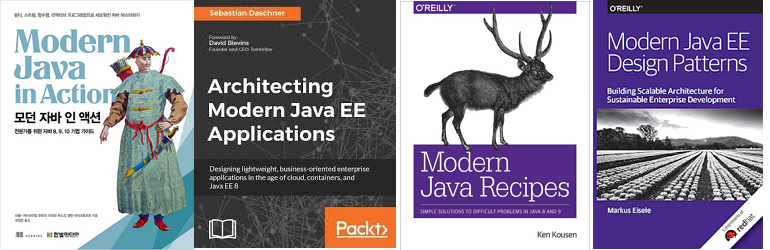

# 모던 자바의 시작, Java 8

---

Java 8의 새로운 기능과 Java 8 도입을 위한 기초 가이드

- Java 버전 전환의 필요성
- Java 8 주요 기능 소개
- Java 8 전환 방법 소개

2020-07-01 (수) 13:20 ~ 13:40
솔루션연구팀 플랫폼연구담당 이상현

---

Java 버전 전환의 필요성

Java 8 주요 변화

Java 8 전환 방법

---

## Java 버전 히스토리

> Java 8 릴리즈 : 2014년도

|  Java 릴리즈  |  릴리즈 날짜   |
| :-----------: | :------------: |
|   Java SE 6   |   2006.12.23   |
|   Java SE 7   |   2011.07.28   |
| **Java SE 8** (LTS) | **2014.03.18** |
|      Java SE 9       |   2017.09.21   |
|      Java SE 10      |   2018.03.20   |
| **Java SE 11** (LTS) | **2018.09.25** |
|      Java SE 12      |   2019.03.19   |
|      Java SE 13      |   2019.09.17   |
|      Java SE 14      |   2020.03.17   |

>  LTS: Long Term Support
>
>  MTS: Medium Term Support


> 이미지 직접 캡쳐: [https://www.oracle.com/java/technologies/java-se-support-roadmap.html](https://www.oracle.com/java/technologies/java-se-support-roadmap.html)


> 이미지 링크: [DZone: Beyond Java 8](https://dzone.com/articles/beyond-java-8)

## Mordern Java

> Java 8에서 추가된 큰 변화를 때문에, Java 8 이전을 클래식 자바, Java 9 이후를 모던 자바라고 흔히 분류하기도 한다.

* 클래식 자바
* 모던 자바



> 이미지 검색: 도서 검색 "Modern Java"


## 성능

> 높은 버전의 JDK일 수록 컴파일의 최적화나 GC 알고리즘의 개선을 통해 더 나은 성능을 보여준다.


> 이미지 링크: [OpenJDK Startup From 8 Through 11](https://cl4es.github.io/2018/11/29/OpenJDK-Startup-From-8-Through-11.html)

## 라이브러리

> 라이브러리들도 자바 버전의 상승에 따라 최소 지원 버전이 상승하고 있다.

* Maven 3.3+ - 최소 Java 1.7 이상
* Gradle - 기본 Java 8 이상 구동

* Spring 5 - 최소 Java 8 이상
* 클라우드 서비스 ([MS Azure](https://docs.microsoft.com/ko-kr/azure/developer/java/sdk/java-sdk-azure-get-started), [AWS](https://aws.amazon.com/ko/sdk-for-java/)) - Java 8+

> 스프링 피드백 내용 중
>
> "우리는 JDK 8+로 최소값을 올릴 것입니다.
> 이는 프레임워크 전반에 걸쳐 보다 깨끗한 코드 기반을 구축하고, 핵심 인터페이스에 기본 메서드 구현을 도입하며, 우리의 코어 추상화에서 JDK 8 API(예: Completetable, java.util.function 인터페이스)에 의존할 수 있기 때문에 필수 조건입니다.
>
> [Feedback welcome: Spring 5 system requirements](https://spring.io/blog/2015/06/10/feedback-welcome-spring-5-system-requirements)

## 문제점은?

> Java 9부터 제거된 API들이 존재하고, 모듈 방식을 지원하면서 코드 작성이 필요한 부분이 발생한다.

* Java 8은 거의 모든 OS 에서 지원한다.

* Java 9의 모듈 시스템 (Project Jigsaw)
* Java 9, 10 에서 제거된 deprecated API


> 이미지 링크: [https://openjdk.java.net/projects/jigsaw/](http://openjdk.java.net/projects/jigsaw/doc/jdk-modularization.html)


<!-- -->

---

# New Feature

## Interface의 변화

> 자바 인터페이스에서도 구현 메서드를 작성할 수 있게 되었다.

* defaut method
* static method

---

>전환 방법

* 자식 클래스마다 중복되는 코드 정리

* 의미 없는 추상 클래스 패턴 제거

---

>전환시 고려사항

* 다중 상속 관계

## Lambda Expression

> 익명 클래스 및 익명 메서드를 축약하여 표현할 수 있는 방법이 추가되었다.

* 함수형 인터페이스
* 메서드 레퍼런스

---

> 전환 방법

* 익명 함수를 사용하는 부분

## Stream

> Stream API 의 도입으로 선언적 프로그래밍이 가능해졌다.

---

> 전환 방법

* 반복, 추출, 검색, 확인, 검증 등 모든 상황에서

---

> 전환시 고려사항

* 성능상의 이득을 보장하지는 않음

## Optional

>빈 객체 (null)을 판단 할 수 있는 새로운 기능이 추가되었다.

* 기존 자바에서 `null` 사용으로 발생할 수 있던 문제들
* `java.util.Optional<T>`이 추가됨으로써, 문제를 해결하는 쉬운 방법이 제시됨

---

> 전환 방법

* `null`을 반환하는 부분
* 예외가 발생하는 부분

## Date-Time

> 기존의 Date, Calendar를 대신하는 새로운 날짜, 시간 API가 추가되었다.

* 기존 API의 설계 결함
* 쉽게 간단하게 날짜와 시간을 정의하는 새로운 API

---

>전환시 고려사항

* 기존에 사용 중인 라이브러리에서 계속 legacy API 를 사용한다면 우선 호환성 확인이 필요
* 전환하는데 비용이 크게 발생하지 않는다면, 지속적으로 활용될 영역일 수록 전환을 고려

# JVM

기존 HotSpotVM(Java 7 까지)에서 OOM을 방지하기 위해 작성해주어야 했던 JVM 옵션은 아래와 같았다.

```properties
-XX:PermSize
-XX:MaxPermSize
```

---

>  HotSaptVM 8 에서 Metaspace 영역이 새로 추가되었다.

Java 8 HotSpotVM에서는 Permernant  Heap 영역은 사라지고 Metaspcace 영역이 생겼다.

> **Perm 영역**은 보통 Class의 Meta 정보나 Method의 Meta 정보, Static 변수와 상수 정보들이 저장되는 공간으로 흔히 메타데이터 저장 영역이라고도 한다. 이 영역은 Java 8 부터는 Native 영역으로 이동하여 **Metaspace 영역**으로 변경되었다. (다만, 기존 Perm 영역에 존재하던 Static Object는 Heap 영역으로 옮겨져서 GC의 대상이 최대한 될 수 있도록 하였다)

|                          | Java 7                               | Java 8                                         |
| ------------------------ | ------------------------------------ | ---------------------------------------------- |
| Class 메타 데이터        | 저장                                 | 저장                                           |
| Method 메타 데이터       | 저장                                 | 저장                                           |
| Static Object 변수, 상수 | 저장                                 | Heap 영역으로 이동                             |
| 메모리 튜닝              | Heap, Perm 영역 튜닝                 | Heap 튜닝, Native 영역은 OS가 동적 조정        |
| 메모리 옵션              | `-XX:PermSize`<br/>`-XX:MaxPermSize` | `-XX:MetaspaceSize`<br/>`-XX:MaxMetaspaceSize` |

> 최근 Java 8에서 JVM 메모리 구조적인 개선 사항으로 Perm 영역이 Metaspace 영역으로 전환되고 기존 Perm 영역은 사라지게 되었다. Metaspace 영역은 Heap이 아닌 Native 메모리 영역으로 취급하게 된다. (Heap 영역은 JVM에 의해 관리된 영역이며, Native 메모리는 OS 레벨에서 관리하는 영역으로 구분된다) Metaspace가 Native 메모리를 이용함으로서 개발자는 영역 확보의 상한을 크게 의식할 필요가 없어지게 되었다.

---

> 전환 방법

Java 8 환경에서의 메모리 관련 옵션은 다음과 같습니다.

```shell
$ Java \
-XX:+HeapDumpOnOutOfMemoryError \
-XX:HeapDumpPath=<<덤프 파일 위치>> \
-Xmx2048m \
-Xms1024m \
-XX:MetaspaceSize=256m \ 			#필요시
-XX:MaxMetaspaceSize=512m \			#필요시
...
```


---

# 전환 방법

* 사용하고 있는 도구(CI & CD, IDE, 분석도구 등)가 Java8을 지원하는지 확인
* 사용하고 있는 라이브러리가 Java 8을 지원하는지 확인
* 제품이 JDK8로 컴파일되고 실행되는지 확인
* 가능하다면 JVM 모니터링 (G1GC, Full GC)을 통해 안정성을 확인
* Java8의 새로운 기능을 적용했다면 원하는 목적을 달성했는지 확인

## 일반적인 방법

* 새로운 코드는 Java 8로 작성
* 기존 코드는 Java 8로 재컴파일
* 기존 바이너리는 JDK8 환경에서 실행

## 새로운 기능 적용

* 변경 대상 선정
  * 리펙토링
  * 최적화
  * 기능 추가, 수정
* 목적과 최종 적용 여부 판단
* 목적에 부합하는지 테스트

---

> END


# 라이센스

# 기술지원


